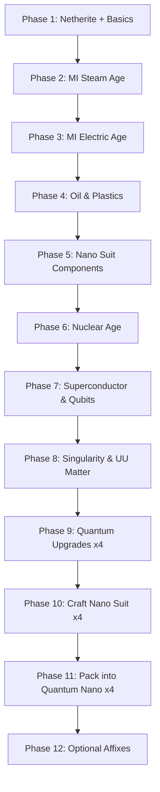

# ATM10 v7.0 — Quantum Nano Armor Guide

> **Goal:** Craft the full **Extended Industrialization Quantum Nano Armor** set — the armor featured in [John Hall's video](https://www.youtube.com/watch?v=_NKFPgX152A).
>
> **Pack:** All The Mods 10 · **Version:** 7.0 · **Minecraft:** 1.21.1

---

## Table of Contents

1. [What You Are Building](#what-you-are-building)
2. [Is This Still the Best Armor?](#is-this-still-the-best-armor)
3. [Progression Overview](#progression-overview)
4. [Phase-by-Phase Walkthrough](#phase-by-phase-walkthrough)
5. [Final Craft — Exact Recipes](#final-craft--exact-recipes)
6. [Total Material Shopping List](#total-material-shopping-list)
7. [Power & Charging](#power--charging)
8. [Optional: Affixes & Enchants](#optional-affixes--enchants)
9. [ATM10 Tips & Gotchas](#atm10-tips--gotchas)
10. [Helpful Resources](#helpful-resources)

---

## What You Are Building

| Slot | Item ID | Display Name |
|------|---------|--------------|
| Head | `extended_industrialization:nano_quantum_helmet` | Quantum Nano Helmet |
| Chest | `extended_industrialization:nano_quantum_chestplate` | Quantum Nano Chestplate |
| Legs | `extended_industrialization:nano_quantum_leggings` | Quantum Nano Leggings |
| Feet | `extended_industrialization:nano_quantum_boots` | Quantum Nano Boots |

**How it works (2-step process per piece):**

```
Step 1: Electric Assembler  →  Nano Suit piece
Step 2: Electric Packer       →  Nano piece + Quantum Upgrade = Quantum Nano piece
```

This is **not** the same as:
- `modern_industrialization:quantum_*` (MI's own quantum armor)
- `advanced_ae:quantum_*` (Advanced AE armor — requires Unobtainium + AE2)

---

## Is This Still the Best Armor?

| Question | Answer |
|----------|--------|
| Still top-tier survivability in v7.0? | **Yes** |
| Recipe nerfed in v7.0? | **No** — still uses Netherite armor, not Unobtainium |
| Better than MI Quantum Armor? | **Yes** — same invincibility + extra Nano buffs (speed, step assist, etc.) |
| Better than MekaSuit / Advanced AE? | **For raw "don't die" — yes.** For utility modules (magnet, auto-feed, etc.) — those are better |

### Known weaknesses
- **Chaos Guardian laser** can still damage you ([ATM10 issue #3976](https://github.com/AllTheMods/ATM-10/issues/3976))
- Armor runs on **MI EU power** — keep it charged
- **MI machine upgrades strip affixes/enchants** — remove them first if you care

---

## Progression Overview



**Estimated timeline (solo, no prior MI progress):** Many hours to days. Phases 6–9 are the real endgame wall.

---

## Phase-by-Phase Walkthrough

---

### Phase 1 — Netherite & Early Setup

**Goal:** Get the armor base and basic infrastructure.

| Need | Amount | How to get |
|------|--------|------------|
| Netherite Helmet | 1 | Upgrade diamond helmet at smithing table |
| Netherite Chestplate | 1 | Same |
| Netherite Leggings | 1 | Same |
| Netherite Boots | 1 | Same |
| Ancient Debris | 16+ | Nether mining (or quarry later) |

**Also set up now:**
- [ ] Osmium Paxel (best early tool)
- [ ] Basic power (wind generators / charcoal)
- [ ] Storage (chests → AE2 when ready)
- [ ] MI Guide Book (craft or find in JEI — read the Steam Age entry)

**Unlocks:** Phase 2

**Quest book:** `Getting Started`, `Basic Tools`, `Basic Power`

---

### Phase 2 — MI Steam Age

**Goal:** Steel, coke, and your first multiblocks.

**Key machines to craft:**
| Machine | Why |
|---------|-----|
| Forge Hammer | Manual crafting helper |
| Bronze Macerator | Ore doubling → dust |
| Steam Furnace | Smelting |
| Bronze Mixer | Better material ratios |
| Steam Quarry (optional) | Automated ores — huge time saver |

**Key multiblocks:**
| Multiblock | Output |
|------------|--------|
| **Coke Oven** | Coke → Coke Dust (needed later for quantum upgrades) |
| **Steam Blast Furnace** | Steel ingots |
| **Bronze Boiler + Steam Turbine** | Power |

**Critical materials to stockpile:**
| Material | Target amount | Notes |
|----------|---------------|-------|
| Steel | 500+ ingots | Everything needs steel |
| Coke Dust | 200+ | Used in many endgame recipes |
| Fire Clay | 64+ bricks | Blast furnace structure |
| Bronze / Tin / Copper | Lots | Circuits and casings |

**Unlocks:** Electric Age machines

**Quest book:** `Steam Age: New Beginnings`

**Video:** [How to Beat Modern Industrialization](https://www.youtube.com/watch?v=XnOiyhiqZRs) — covers steam → electric

---

### Phase 3 — MI Electric Age

**Goal:** Electric machines, oil access, and component automation.

**Machines you MUST have before Phase 4:**
| Machine | Used for |
|---------|----------|
| **Electric Assembler** | Almost all advanced crafting |
| **Electric Packer** | Quantum nano upgrade step |
| **Electric Compressor** | Carbon plates |
| **Centrifuge** | Carbon dust, silicon |
| **Distillery** | Nylon + polyethylene chain |
| **Chemical Reactor** | Polymerization, caprolactam |
| **Wire Mill** | Cables |
| **Electric Blast Furnace** | Aluminum, silicon, stainless steel |
| **Oil Drilling Rig** | Crude oil |

**Automate these in Assemblers ASAP** (MI guidebook recommendation):
- Machine Hulls (all tiers)
- Analog / Electronic circuits
- Motors, Pistons, Robot Arms, Conveyor Belts

**Power upgrade path:**
```
LV (32 EU/t) → MV (128 EU/t) → HV (512 EU/t) → EV (2048 EU/t)
```
Use transformers between tiers. Diesel generators are a strong mid-game power source.

**Also recommended:**
- [ ] AE2 ME system for autocrafting and storage
- [ ] Slot-lock recipes in assemblers (see Tips section)

**Unlocks:** Oil processing, electronic components

**Quest book:** `The Electric Age`, `Electric Age: No more rookie`

---

### Phase 4 — Oil & Plastics (Nylon + Polyethylene)

**Goal:** Produce the fluids needed for every Nano Suit piece.

Each armor piece needs:
- **4,000 mB Polyethylene**
- **2,000 mB Nylon**

**Full set total:**
| Fluid | Total needed |
|-------|--------------|
| Polyethylene | **16,000 mB** (16 buckets) |
| Nylon | **8,000 mB** (8 buckets) |

---

#### Polyethylene chain

```
Oil → Distillation → ... → Ethylene → Chemical Reactor → Polyethylene
```

**Simple ethylene route (no full oil cracking needed early):**
1. Mixer: Sugar → Sugar Solution
2. Distillery: Sugar Solution → Ethanol
3. Chemical Reactor: Ethanol → Ethylene

**Polymerization (Chemical Reactor):**
| Input | Output |
|-------|--------|
| 500 mB Ethylene + 4× Tiny Lead Dust | 300 mB Polyethylene |

**To make 16,000 mB polyethylene you need ~27,000 mB ethylene** (run multiple batches).

---

#### Nylon chain

```
Benzene + Hydrogen + Nickel → Caprolactam → Chemical Reactor → Nylon
```

**Caprolactam (Chemical Reactor):**
| Input | Output |
|-------|--------|
| 500 mB Benzene + 750 mB Hydrogen + 4× Tiny Nickel Dust | 600 mB Caprolactam |

*Benzene comes from distilling Steam-Cracked Light Fuel (oil chain).*

**Polymerization (Chemical Reactor):**
| Input | Output |
|-------|--------|
| 500 mB Caprolactam + 4× Tiny Lead Dust | 300 mB Nylon |

**To make 8,000 mB nylon you need ~13,500 mB caprolactam.**

---

**Machines needed this phase:**
- [ ] Oil Drilling Rig (running)
- [ ] Distillery (multiple recipes — use JEI to cycle outputs)
- [ ] Chemical Reactor
- [ ] Mixer
- [ ] Fluid pipes + tanks for storage

**Unlocks:** Phase 5 nano crafting

---

### Phase 5 — Nano Suit Components

**Goal:** Craft all parts needed for the 4 Nano Suit pieces (not the armor itself yet — that's Phase 10).

#### Carbon Plates (96 total)

```
Carbon Dust → Electric Compressor → Carbon Plate
```
- Carbon dust from **Centrifuge** (process coal/ores — check JEI)
- In ATM10: use **MI coal dust** (not Mekanism coal dust) for coke/steel recipes

#### Electronic Circuits (16 total)

Crafting table recipe per circuit:
| Component | Per circuit |
|-----------|-------------|
| Diode | 2 |
| Analog Circuit | 2 |
| Transistor | 2 |
| Electronic Circuit Board | 1 |

#### Silicon Batteries (8 total)

Crafting table recipe per battery:
| Component | Per battery |
|-----------|-------------|
| Battery Alloy Plate | 2 |
| Electrum Cable | 2 |
| Battery Alloy Curved Plate | 4 |
| Silicon Dust | 2 |

#### Large Motors (16 total)

Crafting table recipe per motor:
| Component | Per motor |
|-----------|-----------|
| Electronic Circuit | 1 |
| Aluminum Rod | 3 |
| Motor | 6 |

#### Redstone Control Modules (3 total)

Crafting table recipe per module:
| Component | Per module |
|-----------|------------|
| Redstone | 2 |
| Redstone Torch | 2 |
| Capacitor | 1 |
| Resistor | 2 |
| Analog Circuit Board | 1 |
| Inductor | 2 |

#### Other
| Item | Amount |
|------|--------|
| Glass Panes | 4 |

**Unlocks:** Phase 10 (once you also have Quantum-tier machines from Phases 6–9)

---

### Phase 6 — Nuclear Age

**Goal:** Nuclear power, advanced materials, path to superconductors.

**Key structures:**
| Structure | Purpose |
|-----------|---------|
| **Nuclear Reactor** | Massive power + radioactive materials |
| **Implosion Compressor** | Singularity crafting (Phase 8) |
| **Vacuum Freezer** | Hot ingot cooling |
| **Large Chemical Reactor** | Better chemical throughput |

**Key materials to work toward:**
- Plutonium / Uranium processing
- Iridium (for quantum circuit boards)
- Processing Units & Processing Unit Boards
- Highly Advanced Upgrades (needed for Quantum Upgrades)

**Highly Advanced Upgrade recipe (per 4 upgrades):**
| Input | Amount |
|-------|--------|
| Large Advanced Motor | 8 |
| Large Advanced Pump | 4 |
| Turbo Upgrade | 4 |
| Processing Unit Board | 1 |
| Polyvinyl Chloride | 2,500 mB |

**You need 128 Highly Advanced Upgrades total** (32 per Quantum Upgrade × 4).

**Unlocks:** Superconductor tier

**Quest book:** `Implosion Power`, `Mekanism: Reactors` (for general nuclear knowledge)

---

### Phase 7 — Superconductor & Qubits

**Goal:** Quantum circuits and quantum machine hulls.

#### Quantum Circuit Board (Assembler — LOCK THIS RECIPE)

| Input | Amount |
|-------|--------|
| Superconductor Cable | 12 |
| Plutonium Battery | 2 |
| Processing Unit Board | 1 |
| Iridium Plate | 6 |
| Helium-3 | 50 mB |

**Output:** 1× Quantum Circuit Board

*You need 4 boards for quantum upgrades + more for quantum circuits.*

#### Quantum Circuit (Crafting Table)

| Component | Amount |
|-----------|--------|
| Processing Unit | 4 |
| Cooling Cell | 4 |
| Qubit | 4 |
| Quantum Circuit Board | 1 |

**Output:** 1× Quantum Circuit

#### Qubit (Assembler)

| Input | Amount |
|-------|--------|
| Arithmetic Logic Unit | 2 |
| Carbon Plate | 2 |
| Glass Pane | 2 |
| Superconductor Wire | 6 |
| Cryofluid | 250 mB |
| Tritium | 50 mB |

**Output:** 1× Qubit

*You need 32 Qubits total (8 per Quantum Upgrade × 4).*

#### Quantum Machine Hull (Crafting Table)

| Component | Amount |
|-----------|--------|
| Plutonium Battery | 2 |
| Quantum Circuit | 1 |
| Quantum Machine Casing | 1 |
| Superconductor Cable | 3 |

**Action items:**
- [ ] Upgrade your **Electric Assembler** to use Quantum Machine Hull
- [ ] Upgrade your **Electric Packer** to use Quantum Machine Hull
- [ ] Insert a **Quantum Upgrade** into each machine (for crafting speed)

**Unlocks:** Phase 8 (singularity)

---

### Phase 8 — Singularity & UU Matter

**Goal:** Craft the exotic items needed for Quantum Upgrades.

#### Singularity (Implosion Compressor)

| Input | Amount |
|-------|--------|
| Ultradense Metal Ball | 1 |
| Nuke | 64 |

**Output:** 1× Singularity

*You need 4 singularities (1 per Quantum Upgrade).*

#### UU Matter

Produced from the **Fusion Reactor** chain. You need **200 mB total** (50 mB per Quantum Upgrade × 4).

**Fusion Reactor is a major multiblock.** Follow the in-game MI guidebook "FUUUUUSION" and "E = mc²" entries.

**Unlocks:** Phase 9

---

### Phase 9 — Quantum Upgrades (×4)

**Goal:** Craft 4 Quantum Upgrades — the most expensive single item in this guide.

**Recipe (Electric Assembler):**

| Input | Amount |
|-------|--------|
| Highly Advanced Upgrade | 32 |
| Quantum Circuit | 8 |
| Singularity | 1 |
| Quantum Circuit Board | 1 |
| UU Matter | 50 mB |

**Output:** 1× Quantum Upgrade

### Totals for 4 Quantum Upgrades

| Material | Total |
|----------|-------|
| Highly Advanced Upgrade | **128** |
| Quantum Circuit | **32** |
| Singularity | **4** |
| Quantum Circuit Board | **4** |
| UU Matter | **200 mB** |

**Tip from John Hall's video:** Once you can make Quantum Upgrades, the armor itself is relatively fast. The grind is everything leading up to this.

**Unlocks:** Phase 10 + 11 (final armor)

---

### Phase 10 — Craft Nano Suit (×4)

**Goal:** Assemble all 4 Nano Suit pieces in a **Quantum-tier Electric Assembler**.

Use JEI (`R` on item) to set up autocraft patterns in AE2.

#### Nano Helmet

| Input | Amount |
|-------|--------|
| Netherite Helmet | 1 |
| Carbon Plate | 20 |
| Electronic Circuit | 4 |
| Silicon Battery | 2 |
| Large Motor | 4 |
| Glass Pane | 4 |
| Redstone Control Module | 1 |
| Polyethylene | 4,000 mB |
| Nylon | 2,000 mB |

#### Nano Chestplate

| Input | Amount |
|-------|--------|
| Netherite Chestplate | 1 |
| Carbon Plate | 32 |
| Electronic Circuit | 4 |
| Silicon Battery | 2 |
| Large Motor | 4 |
| Polyethylene | 4,000 mB |
| Nylon | 2,000 mB |

#### Nano Leggings

| Input | Amount |
|-------|--------|
| Netherite Leggings | 1 |
| Carbon Plate | 28 |
| Electronic Circuit | 4 |
| Silicon Battery | 2 |
| Large Motor | 4 |
| Redstone Control Module | 1 |
| Polyethylene | 4,000 mB |
| Nylon | 2,000 mB |

#### Nano Boots

| Input | Amount |
|-------|--------|
| Netherite Boots | 1 |
| Carbon Plate | 16 |
| Electronic Circuit | 4 |
| Silicon Battery | 2 |
| Large Motor | 4 |
| Redstone Control Module | 1 |
| Polyethylene | 4,000 mB |
| Nylon | 2,000 mB |

**Unlocks:** Phase 11

---

### Phase 11 — Upgrade to Quantum Nano (×4)

**Goal:** Final step — pack each Nano piece with a Quantum Upgrade.

**Machine:** Quantum-tier **Electric Packer** (with Quantum Upgrade inserted)

**Recipe (same for all 4 slots):**

| Input | Amount |
|-------|--------|
| Nano Suit piece | 1 |
| Quantum Upgrade | 1 |

**Output:** Quantum Nano piece

| Step | Input | Output |
|------|-------|--------|
| 1 | Nano Helmet + Quantum Upgrade | **Quantum Nano Helmet** |
| 2 | Nano Chestplate + Quantum Upgrade | **Quantum Nano Chestplate** |
| 3 | Nano Leggings + Quantum Upgrade | **Quantum Nano Leggings** |
| 4 | Nano Boots + Quantum Upgrade | **Quantum Nano Boots** |

**🎉 Done — you have the best survivability armor in ATM10.**

---

### Phase 12 — Optional: Affixes & Enchants

From [John Hall's video](https://www.youtube.com/watch?v=_NKFPgX152A):

1. **Apotheosis Reforging Table** — roll affixes (Fireproof, Lucky, Speed When Attacked, etc.)
2. **Sigils of Rebirth** — reroll to higher affix tiers
3. **Anvil** — apply enchantments

**Suggested enchants (diminishing returns on protection — armor already negates damage):**
| Piece | Useful enchants |
|-------|-----------------|
| Helmet | Respiration, Aqua Affinity, Thorns |
| Chestplate | Thorns, Swift Sneak |
| Leggings | Swift Sneak, Thorns |
| Boots | Feather Falling, Depth Strider, Soul Speed |

**Warning:** If you re-run armor through MI machines later, affixes and enchants may be **removed**. Strip them with an anvil + books first if you want to keep them.

---

## Final Craft — Exact Recipes

### Summary table (full set)

| Category | Item | Total Qty |
|----------|------|-----------|
| **Armor base** | Netherite Helmet / Chest / Legs / Boots | 1 each |
| **Plates** | Carbon Plate | 96 |
| **Circuits** | Electronic Circuit | 16 |
| **Batteries** | Silicon Battery | 8 |
| **Motors** | Large Motor | 16 |
| **Modules** | Redstone Control Module | 3 |
| **Glass** | Glass Pane | 4 |
| **Fluids** | Polyethylene | 16,000 mB |
| **Fluids** | Nylon | 8,000 mB |
| **Upgrades** | Quantum Upgrade | 4 |
| **For upgrades** | Highly Advanced Upgrade | 128 |
| **For upgrades** | Quantum Circuit | 32 |
| **For upgrades** | Singularity | 4 |
| **For upgrades** | Quantum Circuit Board | 4 |
| **For upgrades** | UU Matter | 200 mB |

---

## Power & Charging

Quantum Nano Armor uses **MI EU** (not AE energy, not FE).

| Method | Notes |
|--------|-------|
| Armor internal battery | Charges from your inventory power items |
| Curios battery items | Silicon / higher tier batteries in inventory |
| Player Transmitters + Binding Cards | Wireless charging (video setup — optional) |
| Fusion / Plasma power | Endgame EU generation |

**Minimum recommendation:** Keep charged batteries in your inventory at all times. Set up wireless charging if you have the infrastructure.

---

## ATM10 Tips & Gotchas

### Recipe verification
Always press **`R`** in JEI/EMI on the item you want to craft. ATM10 uses **KubeJS** tweaks — some materials are unified (e.g. only MI coke/coke dust counts).

### Assembler slot locking
Shift-clicking recipes into MI machines can put the **wrong item variant** in slots ([known ATM10 issue](https://github.com/AllTheMods/ATM-10/issues/1667)).

**Fix:**
1. Enable "Lock Editing" on the machine
2. Manually place the correct items in each slot
3. Save the locked recipe

**Critical recipes to lock:**
- Quantum Circuit Board
- Quantum Upgrade
- All Nano Suit pieces

### Coal / coke confusion
- Use **Modern Industrialization coke dust** (from MI coke oven → macerator)
- Mekanism coal dust is a **different item** for steel/coke recipes
- Carbon dust comes from the **Centrifuge**, not the macerator

### AE2 autocrafting
Set up ME autocrafting patterns for:
- Motors, circuits, cables (bulk intermediates)
- Carbon plates
- Polyethylene / Nylon (fluid crafting)
- All 4 nano pieces + 4 quantum upgrades

### No Unobtainium required
Unlike **Advanced AE Quantum Armor** (which ATM10 changed to require Unobtainium armor pieces), the **EI Quantum Nano** path still uses **Netherite** in v7.0.

---

## Helpful Resources

### Videos
| Resource | Link |
|----------|------|
| **Armor guide (this armor)** | [John Hall — Best Armor ATM10](https://www.youtube.com/watch?v=_NKFPgX152A) |
| **MI prerequisite (quantum sword/tech)** | [John Hall — MI Progression](https://youtu.be/KhPAUzlwsaQ) |
| **Full MI walkthrough** | [How to Beat Modern Industrialization](https://www.youtube.com/watch?v=XnOiyhiqZRs) |

### In-game
| Resource | Where |
|----------|-------|
| MI Guide Book | Craft / JEI — read every age entry |
| FTB Quests | `Basic Armor`, `The Electric Age`, `Electric Age: No more rookie` |
| JEI/EMI | Press `R` on any item for recipes — **source of truth** |

### Online
| Resource | Link |
|----------|------|
| ATM10 gear overview | [all-themods.com/weapons](https://all-themods.com/weapons/) |
| MI unofficial wiki | [MI Wiki](https://unofficial-modern-industrialization.fandom.com/wiki/The_Endgame) |
| Chaos Guardian caveat | [GitHub #3976](https://github.com/AllTheMods/ATM-10/issues/3976) |

---

## Quick Checklist (print this)

```
PHASE 1  [ ] Full Netherite armor set
PHASE 2  [ ] Coke Oven + Steel production
PHASE 3  [ ] Electric Assembler + Packer + Compressor + Centrifuge
         [ ] Oil Drilling Rig running
         [ ] AE2 autocrafting online
PHASE 4  [ ] 16 buckets Polyethylene stocked
         [ ] 8 buckets Nylon stocked
PHASE 5  [ ] 96 Carbon Plates
         [ ] 16 Electronic Circuits, 8 Silicon Batteries, 16 Large Motors
         [ ] 3 Redstone Control Modules
PHASE 6  [ ] Nuclear reactor power
         [ ] 128 Highly Advanced Upgrades crafted
PHASE 7  [ ] Superconductor infrastructure
         [ ] 32 Quantum Circuits + 4 Quantum Circuit Boards
         [ ] Quantum Machine Hulls on Assembler + Packer
PHASE 8  [ ] Fusion Reactor running
         [ ] 4 Singularities
         [ ] 200 mB UU Matter
PHASE 9  [ ] 4 Quantum Upgrades
PHASE 10 [ ] 4 Nano Suit pieces (helmet/chest/legs/boots)
PHASE 11 [ ] 4 Quantum Nano pieces — DONE!
PHASE 12 [ ] Optional affixes + enchants
```

---

*Document generated for ATM10 v7.0. Recipes sourced from Modern Industrialization 1.21.x and Extended Industrialization 1.21.1 GitHub. Always verify in JEI as modpack updates may change recipes.*
